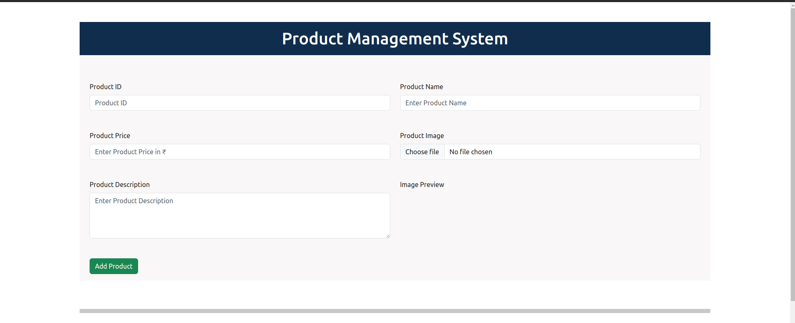
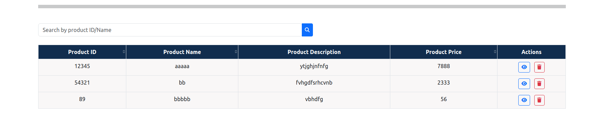
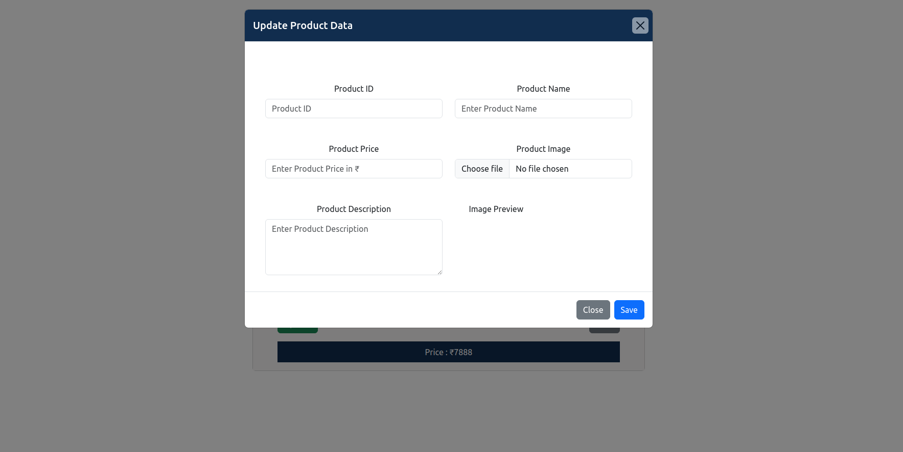
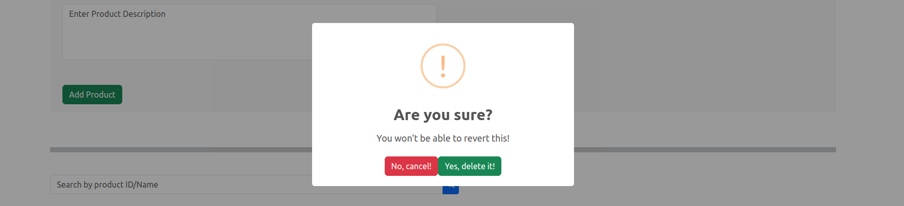
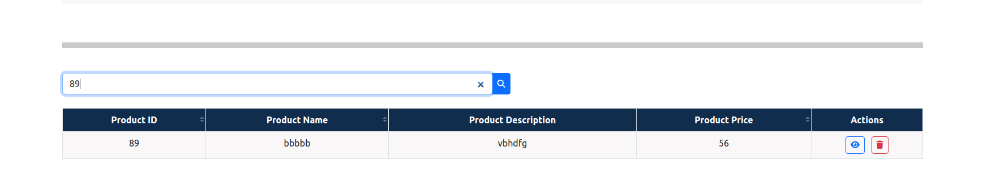
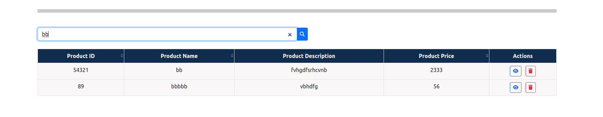

# CRUD-Practical
- This is a Product Management Web Application, which demonstrates CRUD operations with the help of local storage and vanilla javascript.
- We can add product details like product id, name, description, price and image.
- We can also view, update and delete the data stored.

**********
## Tech Stack
- The website is built with famous web development tools, they are mentioned below:
  

**********

## Features
**1. Add data:**
- We can add product data which will be stored in the local storage.
- All the fields are mandatory.
- Once we click on `Add Product` button, the data will be displayed in the form of a table.

 

 

**2. View data:**
- We can view a particular product item by clicking on the `view icon` present in the `Actions` column.
- This will redirect to the view page.

**3. Update data:**
- We can update a product, this is possible by first clicking on the view icon.
- On being redirected to the view page, we get an option to update the data.
- If we click on the `Update` button, a form will pop up, in which we are supposed to fill the new values for the product, all fields are necessary.
- On clicking `Save`, the data gets updated in the local storage and displays the updated data.

**4. Delete data:**
- We can delete the product by clicking on the `delete` icon present in the `Actions` column.
- On clicking it, the data gets deleted from the local storage and we can no longer see that product.

**5. Search:**
- We can search a product by `Product Id1` or `Product Name`.
- Search by product id:

- Search by product name:

**6. Sort:**
- We can sort the products by Product Id, Product Name or Product Price.